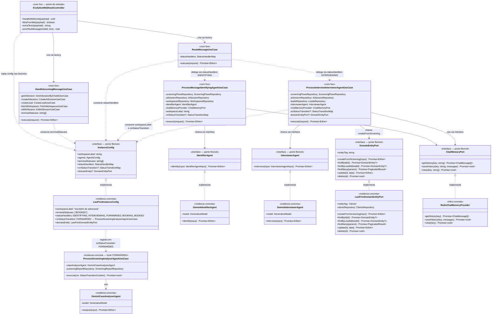
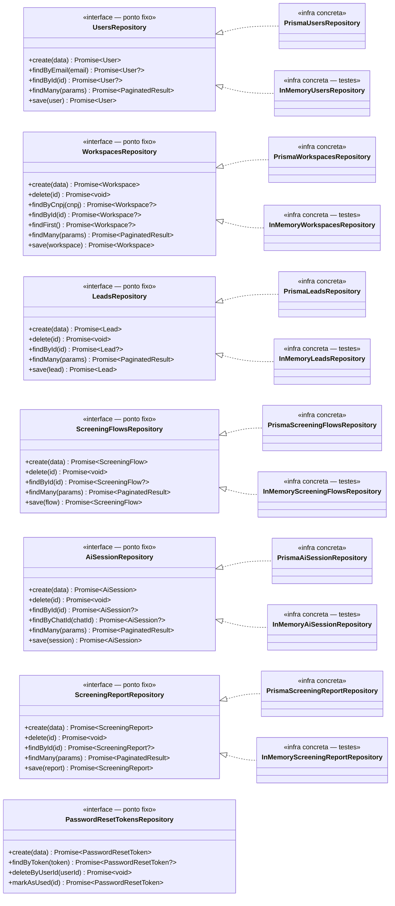
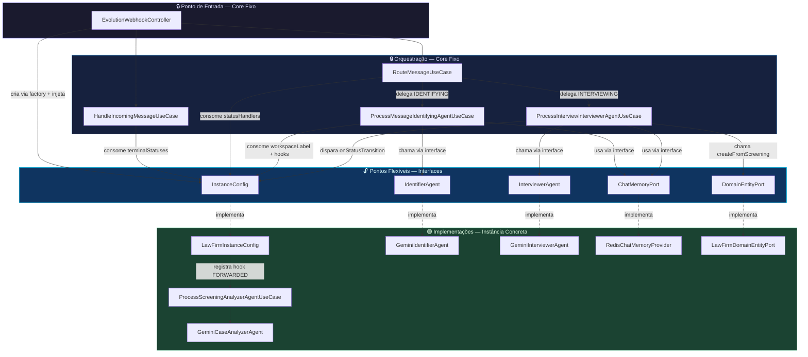

# Vero API — Diagrama de Classes do Framework

> Este diagrama foca na distinção central da arquitetura:
> **pontos fixos** do framework (classes concretas que orquestram o fluxo) →
> **pontos flexíveis** (interfaces/ports que o framework define e consome) →
> **implementações concretas** da instância (subclasses e objetos que preenchem os contratos).

---

## Legenda

| Símbolo / Estereótipo | Significado |
|---|---|
| `<<core fixo>>` | Classe concreta do framework — não pode ser alterada pela instância |
| `<<interface — ponto flexível>>` | Interface do framework — a instância **deve** implementar |
| `<<instância concreta>>` | Implementação fornecida pela instância (escritório de advocacia) |
| `<<infra concreta>>` | Implementação de infraestrutura (Prisma, Redis, In-Memory) |
| `──►` (associação) | "usa / chama" de forma direta |
| `..►` (dependência) | "depende via injeção" |
| `<\|..` (realização) | "implementa a interface" |

---

## 1. Visão Central: Framework × Instância

O diagrama abaixo é o **coração da arquitetura**. Mostra o caminho completo desde o ponto de entrada (webhook) até as implementações concretas da instância, evidenciando onde o framework "chama" os pontos flexíveis.

---

## 2. Repositórios: Interfaces (pontos fixos) × Implementações

O framework define interfaces de repositório que os use cases do core dependem exclusivamente delas. As implementações Prisma e In-Memory são os pontos de variação de infraestrutura.

---

## 3. Use Cases do Core: Pontos Fixos que Dependem dos Repositórios

Os use cases do core são pontos fixos implementados pelo framework e reutilizados por qualquer instância. Eles dependem exclusivamente das interfaces de repositório.

```mermaid
classDiagram
    direction TB

    class HandleIncomingMessageUseCase {
        <<core fixo — orquestração>>
        -getAiSession: GetAiSessionByChatIdUseCase
        -createAiSession: CreateAiSessionUseCase
        -createLead: CreateLeadUseCase
        -fetchWorkspaces: FetchWorkspacesUseCase
        -editAiSession: EditAiSessionUseCase
        -terminalStatuses: string[]
        +execute(request) Promise~Either~
    }

    class RouteMessageUseCase {
        <<core fixo — orquestração>>
        -statusHandlers: StatusHandlerMap
        +execute(request) Promise~Either~
    }

    class ProcessMessageIdentifyingAgentUseCase {
        <<core fixo — orquestração>>
        -screeningFlowsRepository: ScreeningFlowsRepository
        -aiSessionRepository: AiSessionRepository
        -workspacesRepository: WorkspacesRepository
        -identifierAgent: IdentifierAgent
        -chatMemoryProvider: ChatMemoryPort
        -workspaceLabel: string
        -onStatusTransition?: StatusTransitionMap
        +execute(request) Promise~Either~
    }

    class ProcessInterviewInterviewerAgentUseCase {
        <<core fixo — orquestração>>
        -screeningFlowsRepository: ScreeningFlowsRepository
        -aiSessionRepository: AiSessionRepository
        -leadsRepository: LeadsRepository
        -interviewerAgent: InterviewerAgent
        -chatMemoryProvider: ChatMemoryPort
        -onStatusTransition?: StatusTransitionMap
        -domainEntityPort?: DomainEntityPort
        +execute(request) Promise~Either~
    }

    class RegisterUserUseCase {
        <<core fixo — domínio>>
        -usersRepository: UsersRepository
        +execute(request) Promise~Either~
    }
    class AuthenticateUseCase {
        <<core fixo — domínio>>
        -usersRepository: UsersRepository
        +execute(request) Promise~Either~
    }
    class ForgotPasswordUseCase {
        <<core fixo — domínio>>
        -usersRepository: UsersRepository
        -passwordResetTokensRepository: PasswordResetTokensRepository
        -emailSender: MailSender
        +execute(request) Promise~Either~
    }

    class CreateLeadUseCase {
        <<core fixo — domínio>>
        -leadsRepository: LeadsRepository
        -workspacesRepository: WorkspacesRepository
        -usersRepository: UsersRepository
        +execute(request) Promise~Either~
    }
    class EditLeadUseCase {
        <<core fixo — domínio>>
        -leadsRepository: LeadsRepository
        -workspacesRepository: WorkspacesRepository
        -usersRepository: UsersRepository
        +execute(request) Promise~Either~
    }
    class FetchLeadsUseCase {
        <<core fixo — domínio>>
        -leadsRepository: LeadsRepository
        +execute(request) Promise~Either~
    }

    class CreateScreeningFlowUseCase {
        <<core fixo — domínio>>
        -screeningFlowsRepository: ScreeningFlowsRepository
        +execute(request) Promise~Either~
    }
    class FetchScreeningFlowsUseCase {
        <<core fixo — domínio>>
        -screeningFlowsRepository: ScreeningFlowsRepository
        +execute(request) Promise~Either~
    }

    class CreateAiSessionUseCase {
        <<core fixo — domínio>>
        -aiSessionRepository: AiSessionRepository
        -screeningFlowsRepository: ScreeningFlowsRepository
        +execute(request) Promise~Either~
    }
    class EditAiSessionUseCase {
        <<core fixo — domínio>>
        -aiSessionRepository: AiSessionRepository
        -screeningFlowsRepository: ScreeningFlowsRepository
        +execute(request) Promise~Either~
    }
    class GetAiSessionByChatIdUseCase {
        <<core fixo — domínio>>
        -aiSessionRepository: AiSessionRepository
        +execute(request) Promise~Either~
    }

    class CreateScreeningReportUseCase {
        <<core fixo — domínio>>
        -screeningReportRepository: ScreeningReportRepository
        -aiSessionRepository: AiSessionRepository
        +execute(request) Promise~Either~
    }

    class GetDomainEntityUseCase {
        <<core fixo — domínio genérico>>
        -domainEntityPort: DomainEntityPort
        +execute(request) Promise~Either~
    }
    class FetchDomainEntitiesUseCase {
        <<core fixo — domínio genérico>>
        -domainEntityPort: DomainEntityPort
        +execute(request) Promise~Either~
    }
    class UpdateDomainEntityUseCase {
        <<core fixo — domínio genérico>>
        -domainEntityPort: DomainEntityPort
        +execute(request) Promise~Either~
    }
    class DeleteDomainEntityUseCase {
        <<core fixo — domínio genérico>>
        -domainEntityPort: DomainEntityPort
        +execute(request) Promise~Either~
    }

    class UsersRepository { <<interface — ponto fixo>> }
    class LeadsRepository { <<interface — ponto fixo>> }
    class WorkspacesRepository { <<interface — ponto fixo>> }
    class AiSessionRepository { <<interface — ponto fixo>> }
    class ScreeningFlowsRepository { <<interface — ponto fixo>> }
    class ScreeningReportRepository { <<interface — ponto fixo>> }
    class PasswordResetTokensRepository { <<interface — ponto fixo>> }
    class MailSender { <<interface — ponto fixo>> }
    class IdentifierAgent { <<interface — ponto flexível>> }
    class InterviewerAgent { <<interface — ponto flexível>> }
    class ChatMemoryPort { <<interface — ponto flexível>> }
    class DomainEntityPort { <<interface — ponto flexível>> }

    HandleIncomingMessageUseCase --> GetAiSessionByChatIdUseCase
    HandleIncomingMessageUseCase --> CreateAiSessionUseCase
    HandleIncomingMessageUseCase --> CreateLeadUseCase
    HandleIncomingMessageUseCase --> EditAiSessionUseCase

    RouteMessageUseCase ..> ProcessMessageIdentifyingAgentUseCase : delega via handler
    RouteMessageUseCase ..> ProcessInterviewInterviewerAgentUseCase : delega via handler

    ProcessMessageIdentifyingAgentUseCase --> ScreeningFlowsRepository
    ProcessMessageIdentifyingAgentUseCase --> AiSessionRepository
    ProcessMessageIdentifyingAgentUseCase --> WorkspacesRepository
    ProcessMessageIdentifyingAgentUseCase --> IdentifierAgent : chama via interface
    ProcessMessageIdentifyingAgentUseCase --> ChatMemoryPort : usa via interface

    ProcessInterviewInterviewerAgentUseCase --> ScreeningFlowsRepository
    ProcessInterviewInterviewerAgentUseCase --> AiSessionRepository
    ProcessInterviewInterviewerAgentUseCase --> LeadsRepository
    ProcessInterviewInterviewerAgentUseCase --> InterviewerAgent : chama via interface
    ProcessInterviewInterviewerAgentUseCase --> ChatMemoryPort : usa via interface
    ProcessInterviewInterviewerAgentUseCase --> DomainEntityPort : chama createFromScreening

    RegisterUserUseCase --> UsersRepository
    AuthenticateUseCase --> UsersRepository
    ForgotPasswordUseCase --> UsersRepository
    ForgotPasswordUseCase --> PasswordResetTokensRepository
    ForgotPasswordUseCase --> MailSender

    CreateLeadUseCase --> LeadsRepository
    CreateLeadUseCase --> WorkspacesRepository
    CreateLeadUseCase --> UsersRepository
    EditLeadUseCase --> LeadsRepository
    FetchLeadsUseCase --> LeadsRepository

    CreateScreeningFlowUseCase --> ScreeningFlowsRepository
    FetchScreeningFlowsUseCase --> ScreeningFlowsRepository

    CreateAiSessionUseCase --> AiSessionRepository
    CreateAiSessionUseCase --> ScreeningFlowsRepository
    EditAiSessionUseCase --> AiSessionRepository
    GetAiSessionByChatIdUseCase --> AiSessionRepository

    CreateScreeningReportUseCase --> ScreeningReportRepository
    CreateScreeningReportUseCase --> AiSessionRepository

    GetDomainEntityUseCase --> DomainEntityPort
    FetchDomainEntitiesUseCase --> DomainEntityPort
    UpdateDomainEntityUseCase --> DomainEntityPort
    DeleteDomainEntityUseCase --> DomainEntityPort
```

---

## 4. Resumo: Quem Chama Quem (Fluxo Completo)

---

## 5. Tabela de Correspondência: Fixo × Flexível × Concreto

| Ponto Fixo (framework) | Ponto Flexível (interface) | Implementação Concreta (instância) |
|---|---|---|
| `EvolutionWebhookController` | `InstanceConfig` | `LawFirmInstanceConfig` |
| `ProcessMessageIdentifyingAgentUseCase` | `IdentifierAgent` | `GeminiIdentifierAgent` |
| `ProcessInterviewInterviewerAgentUseCase` | `InterviewerAgent` | `GeminiInterviewerAgent` |
| `ProcessMessageIdentifyingAgentUseCase` + `ProcessInterviewInterviewerAgentUseCase` | `ChatMemoryPort` | `RedisChatMemoryProvider` |
| `ProcessInterviewInterviewerAgentUseCase` + use cases genéricos `/entities` | `DomainEntityPort` | `LawFirmDomainEntityPort` |
| `ProcessInterviewInterviewerAgentUseCase` (hook FORWARDED) | `StatusTransitionMap` | `ProcessScreeningAnalyzerAgentUseCase` |
| `HandleIncomingMessageUseCase` | `terminalStatuses: string[]` | `["BOOKED"]` |
| `RouteMessageUseCase` | `statusHandlers: StatusHandlerMap` | `{IDENTIFYING, INTERVIEWING, FORWARDED, BOOKING, BOOKED}` |
| Todos os use cases de domínio do core | `UsersRepository` | `PrismaUsersRepository` / `InMemoryUsersRepository` |
| Todos os use cases de domínio do core | `LeadsRepository` | `PrismaLeadsRepository` / `InMemoryLeadsRepository` |
| Todos os use cases de domínio do core | `AiSessionRepository` | `PrismaAiSessionRepository` / `InMemoryAiSessionRepository` |
| Todos os use cases de domínio do core | `ScreeningFlowsRepository` | `PrismaScreeningFlowsRepository` / `InMemoryScreeningFlowsRepository` |
| Todos os use cases de domínio do core | `ScreeningReportRepository` | `PrismaScreeningReportRepository` / `InMemoryScreeningReportRepository` |
