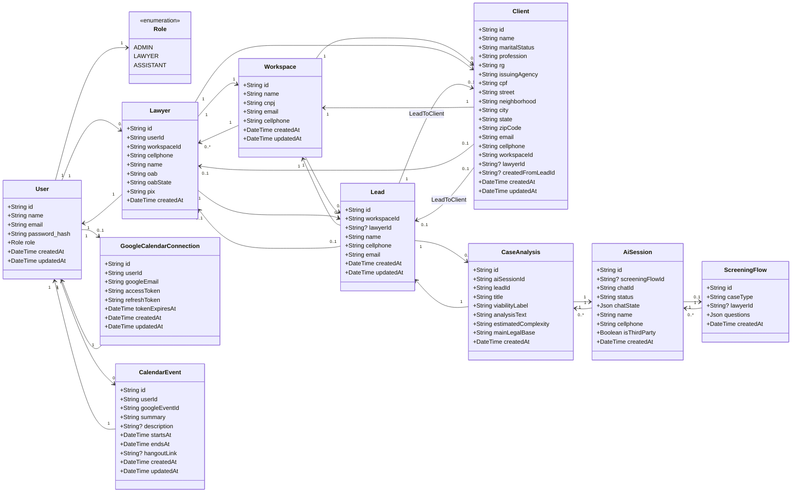
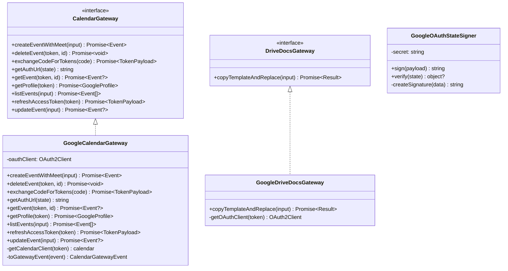
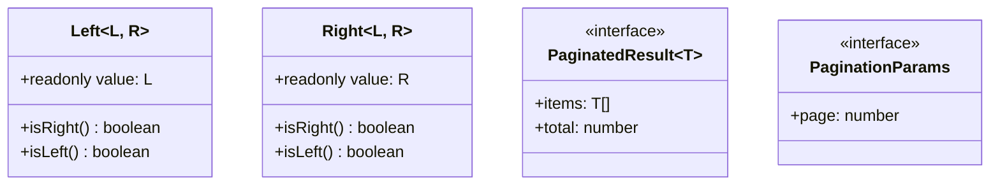

# Vero API — Diagrama de Classes (Mermaid)

## 1. Diagrama de Entidades (Models Prisma)

---

## 2. Diagrama de Repository Interfaces + Implementações

```mermaid
classDiagram
    direction TB

    class UsersRepository {
        <<interface>>
        +create(data) Promise~User~
        +findByEmail(email) Promise~User?~
        +findById(id) Promise~User?~
        +findMany(params) Promise~PaginatedResult~
        +save(user) Promise~User~
    }
    class PrismaUsersRepository {
        +create(data) Promise~User~
        +findByEmail(email) Promise~User?~
        +findById(id) Promise~User?~
        +findMany(params) Promise~PaginatedResult~
        +save(user) Promise~User~
    }
    class InMemoryUsersRepository {
        -items: User[]
        +create(data) Promise~User~
        +findByEmail(email) Promise~User?~
        +findById(id) Promise~User?~
        +findMany(params) Promise~PaginatedResult~
        +save(user) Promise~User~
    }
    UsersRepository <|.. PrismaUsersRepository
    UsersRepository <|.. InMemoryUsersRepository

    class WorkspacesRepository {
        <<interface>>
        +create(data) Promise~Workspace~
        +delete(id) Promise~void~
        +findByCnpj(cnpj) Promise~Workspace?~
        +findById(id) Promise~Workspace?~
        +findMany(params) Promise~PaginatedResult~
        +save(workspace) Promise~Workspace~
    }
    class PrismaWorkspacesRepository
    class InMemoryWorkspacesRepository
    WorkspacesRepository <|.. PrismaWorkspacesRepository
    WorkspacesRepository <|.. InMemoryWorkspacesRepository

    class LawyersRepository {
        <<interface>>
        +create(data) Promise~Lawyer~
        +delete(id) Promise~void~
        +findById(id) Promise~Lawyer?~
        +findByUserId(userId) Promise~Lawyer?~
        +findMany(params) Promise~PaginatedResult~
        +save(lawyer) Promise~Lawyer~
    }
    class PrismaLawyersRepository
    class InMemoryLawyersRepository
    LawyersRepository <|.. PrismaLawyersRepository
    LawyersRepository <|.. InMemoryLawyersRepository

    class LeadsRepository {
        <<interface>>
        +create(data) Promise~Lead~
        +delete(id) Promise~void~
        +findById(id) Promise~Lead?~
        +findMany(params) Promise~PaginatedResult~
        +save(lead) Promise~Lead~
    }
    class PrismaLeadsRepository
    class InMemoryLeadsRepository
    LeadsRepository <|.. PrismaLeadsRepository
    LeadsRepository <|.. InMemoryLeadsRepository

    class ClientsRepository {
        <<interface>>
        +create(data) Promise~Client~
        +delete(id) Promise~void~
        +findById(id) Promise~Client?~
        +findByLeadId(leadId) Promise~Client?~
        +findMany(params) Promise~PaginatedResult~
        +save(client) Promise~Client~
    }
    class PrismaClientsRepository
    class InMemoryClientsRepository
    ClientsRepository <|.. PrismaClientsRepository
    ClientsRepository <|.. InMemoryClientsRepository

    class ScreeningFlowsRepository {
        <<interface>>
        +create(data) Promise~ScreeningFlow~
        +delete(id) Promise~void~
        +findById(id) Promise~ScreeningFlow?~
        +findMany(params) Promise~PaginatedResult~
        +save(sf) Promise~ScreeningFlow~
    }
    class PrismaScreeningFlowsRepository
    class InMemoryScreeningFlowsRepository
    ScreeningFlowsRepository <|.. PrismaScreeningFlowsRepository
    ScreeningFlowsRepository <|.. InMemoryScreeningFlowsRepository

    class AiSessionRepository {
        <<interface>>
        +create(data) Promise~AiSession~
        +delete(id) Promise~void~
        +findById(id) Promise~AiSession?~
        +findMany(params) Promise~PaginatedResult~
        +save(session) Promise~AiSession~
    }
    class PrismaAiSessionRepository
    class InMemoryAiSessionRepository
    AiSessionRepository <|.. PrismaAiSessionRepository
    AiSessionRepository <|.. InMemoryAiSessionRepository

    class CaseAnalysisRepository {
        <<interface>>
        +create(data) Promise~CaseAnalysis~
        +delete(id) Promise~void~
        +findById(id) Promise~CaseAnalysis?~
        +findMany(params) Promise~PaginatedResult~
        +save(ca) Promise~CaseAnalysis~
    }
    class PrismaCaseAnalysisRepository
    class InMemoryCaseAnalysisRepository
    CaseAnalysisRepository <|.. PrismaCaseAnalysisRepository
    CaseAnalysisRepository <|.. InMemoryCaseAnalysisRepository

    class CalendarConnectionsRepository {
        <<interface>>
        +deleteByUserId(userId) Promise~void~
        +findByUserId(userId) Promise~Connection?~
        +upsertByUserId(userId, data) Promise~Connection~
    }
    class PrismaCalendarConnectionsRepository
    class InMemoryCalendarConnectionsRepository
    CalendarConnectionsRepository <|.. PrismaCalendarConnectionsRepository
    CalendarConnectionsRepository <|.. InMemoryCalendarConnectionsRepository

    class CalendarEventsRepository {
        <<interface>>
        +deleteByGoogleEventId(userId, eventId) Promise~void~
        +upsertByGoogleEventId(userId, eventId, data) Promise~CalendarEvent~
    }
    class PrismaCalendarEventsRepository
    class InMemoryCalendarEventsRepository
    CalendarEventsRepository <|.. PrismaCalendarEventsRepository
    CalendarEventsRepository <|.. InMemoryCalendarEventsRepository
```

---

## 3. Diagrama de Use Cases e Dependências

```mermaid
classDiagram
    direction TB

    %% ── Users ──
    class RegisterUserUseCase {
        -usersRepository: UsersRepository
        +execute(request) Promise~Either~
    }
    class AuthenticateUseCase {
        -usersRepository: UsersRepository
        +execute(request) Promise~Either~
    }
    class GetUserProfileUseCase {
        -usersRepository: UsersRepository
        +execute(request) Promise~Either~
    }
    class EditUserUseCase {
        -usersRepository: UsersRepository
        +execute(request) Promise~Either~
    }
    class FetchUsersUseCase {
        -usersRepository: UsersRepository
        +execute(request) Promise~Either~
    }

    %% ── Workspaces ──
    class CreateWorkspaceUseCase {
        -workspacesRepository: WorkspacesRepository
        +execute(request) Promise~Either~
    }
    class EditWorkspaceUseCase {
        -workspacesRepository: WorkspacesRepository
        +execute(request) Promise~Either~
    }
    class DeleteWorkspaceUseCase {
        -workspacesRepository: WorkspacesRepository
        +execute(request) Promise~Either~
    }
    class FetchWorkspacesUseCase {
        -workspacesRepository: WorkspacesRepository
        +execute(request) Promise~Either~
    }
    class GetWorkspaceUseCase {
        -workspacesRepository: WorkspacesRepository
        +execute(request) Promise~Either~
    }

    %% ── Lawyers ──
    class CreateLawyerUseCase {
        -lawyersRepository: LawyersRepository
        -usersRepository: UsersRepository
        -workspacesRepository: WorkspacesRepository
        +execute(request) Promise~Either~
    }
    class EditLawyerUseCase {
        -lawyersRepository: LawyersRepository
        -usersRepository: UsersRepository
        -workspacesRepository: WorkspacesRepository
        +execute(request) Promise~Either~
    }
    class DeleteLawyerUseCase {
        -lawyersRepository: LawyersRepository
        +execute(request) Promise~Either~
    }
    class FetchLawyersUseCase {
        -lawyersRepository: LawyersRepository
        -usersRepository: UsersRepository
        +execute(request) Promise~Either~
    }
    class GetLawyerUseCase {
        -lawyersRepository: LawyersRepository
        -usersRepository: UsersRepository
        +execute(request) Promise~Either~
    }

    %% ── Leads ──
    class CreateLeadUseCase {
        -leadsRepository: LeadsRepository
        -workspacesRepository: WorkspacesRepository
        -usersRepository: UsersRepository
        +execute(request) Promise~Either~
    }
    class EditLeadUseCase {
        -leadsRepository: LeadsRepository
        -workspacesRepository: WorkspacesRepository
        -usersRepository: UsersRepository
        +execute(request) Promise~Either~
    }
    class DeleteLeadUseCase {
        -leadsRepository: LeadsRepository
        +execute(request) Promise~Either~
    }
    class FetchLeadsUseCase {
        -leadsRepository: LeadsRepository
        +execute(request) Promise~Either~
    }
    class GetLeadUseCase {
        -leadsRepository: LeadsRepository
        +execute(request) Promise~Either~
    }

    %% ── Clients ──
    class CreateClientUseCase {
        -clientsRepository: ClientsRepository
        -workspacesRepository: WorkspacesRepository
        -lawyersRepository: LawyersRepository
        +execute(request) Promise~Either~
    }
    class EditClientUseCase {
        -clientsRepository: ClientsRepository
        -lawyersRepository: LawyersRepository
        -workspacesRepository: WorkspacesRepository
        +execute(request) Promise~Either~
    }
    class DeleteClientUseCase {
        -clientsRepository: ClientsRepository
        +execute(request) Promise~Either~
    }
    class FetchClientsUseCase {
        -clientsRepository: ClientsRepository
        +execute(request) Promise~Either~
    }
    class GetClientUseCase {
        -clientsRepository: ClientsRepository
        +execute(request) Promise~Either~
    }
    class ConvertLeadToClientUseCase {
        -leadsRepository: LeadsRepository
        -clientsRepository: ClientsRepository
        -workspacesRepository: WorkspacesRepository
        +execute(request) Promise~Either~
    }
    class GenerateContractUseCase {
        -clientsRepository: ClientsRepository
        -lawyersRepository: LawyersRepository
        -workspacesRepository: WorkspacesRepository
        -driveDocsGateway: DriveDocsGateway
        -calendarConnectionsRepo: CalendarConnectionsRepository
        -calendarGateway: CalendarGateway
        +execute(request) Promise~Either~
    }

    %% ── Calendar ──
    class GenerateGoogleAuthUrlUseCase {
        -calendarGateway: CalendarGateway
        -oauthStateSigner: GoogleOAuthStateSigner
        +execute(request) Promise~Either~
    }
    class ConnectGoogleCalendarUseCase {
        -oauthStateSigner: GoogleOAuthStateSigner
        -calendarGateway: CalendarGateway
        -calendarConnectionsRepo: CalendarConnectionsRepository
        +execute(request) Promise~Either~
    }
    class DisconnectGoogleCalendarUseCase {
        -calendarConnectionsRepo: CalendarConnectionsRepository
        +execute(request) Promise~Either~
    }
    class CreateCalendarEventWithMeetUseCase {
        -calendarConnectionsRepo: CalendarConnectionsRepository
        -calendarEventsRepo: CalendarEventsRepository
        -calendarGateway: CalendarGateway
        +execute(request) Promise~Either~
    }

    %% ── AI / Screening ──
    class CreateAiSessionUseCase {
        -aiSessionRepository: AiSessionRepository
        -screeningFlowsRepository: ScreeningFlowsRepository
        +execute(request) Promise~Either~
    }
    class CreateCaseAnalysisUseCase {
        -aiSessionRepository: AiSessionRepository
        -caseAnalysisRepository: CaseAnalysisRepository
        +execute(request) Promise~Either~
    }
    class CreateScreeningFlowUseCase {
        -screeningFlowsRepository: ScreeningFlowsRepository
        +execute(request) Promise~Either~
    }
```

---

## 4. Diagrama de Infraestrutura (Gateways)

---

## 5. Diagrama de Utilities

