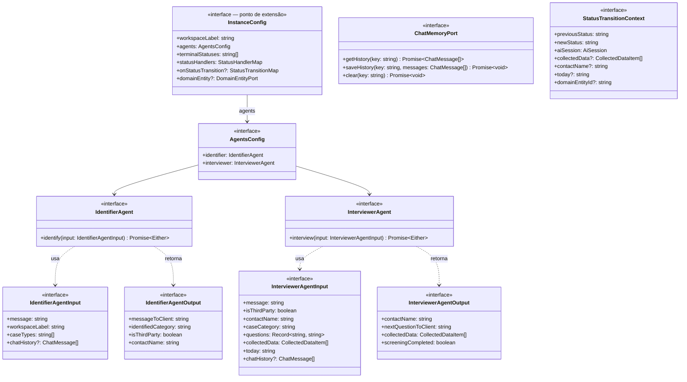
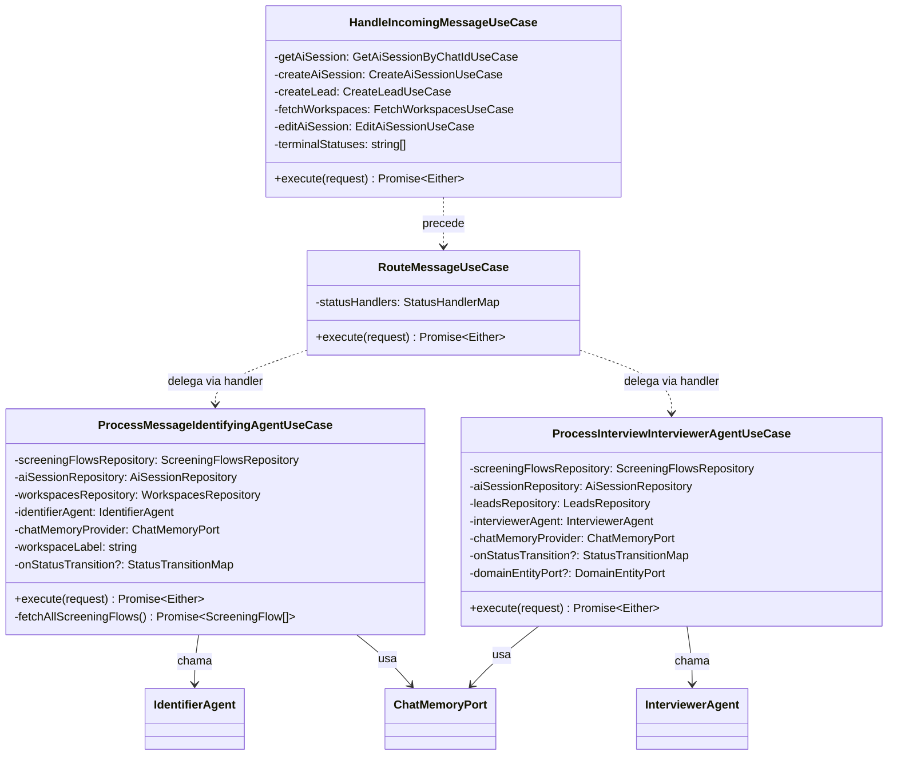
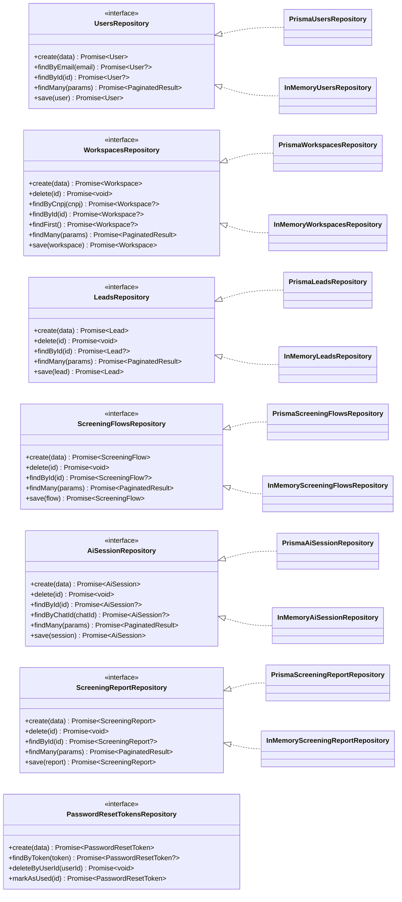

# Vero API — Documentação do Framework de Triagem Conversacional

> Este documento descreve exclusivamente o **framework** que sustenta o fluxo de atendimento conversacional via WhatsApp. Ele é independente do domínio de negócio (advocacia, clínica, construtora, etc.) e pode ser reutilizado por qualquer instância que implemente seus contratos.

---

## Índice

1. [Visão Geral](#1-visão-geral)
2. [Pontos Fixos do Framework](#2-pontos-fixos-do-framework)
3. [Pontos Variáveis do Framework](#3-pontos-variáveis-do-framework)
4. [Como os Pontos Variáveis São Implementados (lado do framework)](#4-como-os-pontos-variáveis-são-implementados-lado-do-framework)
5. [Diagrama de Classes da Arquitetura do Framework](#5-diagrama-de-classes-da-arquitetura-do-framework)

---

## 1. Visão Geral

O framework é um **motor de triagem conversacional stateful**. Ele recebe mensagens de um contato externo (ex: WhatsApp via Evolution API), mantém uma sessão de atendimento com estado persistido no banco, e delega o processamento de cada mensagem para um **handler** determinado pelo **status atual** da sessão.

O framework **não conhece** nenhum domínio específico. Ele apenas:

1. Recebe uma mensagem via webhook.
2. Localiza (ou cria) a sessão e o lead do contato.
3. Roteia a mensagem para o handler do status atual.
4. Persiste a transição de estado.
5. Notifica a instância via hooks sobre as transições ocorridas.

A instância (o projeto concreto) é responsável por preencher todos os pontos variáveis: agentes de IA, handlers de status, hooks de transição e memória de chat.

---

## 2. Pontos Fixos do Framework

Pontos fixos são as abstrações e comportamentos que o framework define e controla. **A instância não pode alterá-los — apenas implementar seus contratos.**

---

### 2.1 Camada de Orquestração de Mensagens

#### 2.1.1 `HandleIncomingMessageUseCase`

**Arquivo:** `src/core/use-cases/orchestrator/handle-incoming-message.ts`

Responsável por **gerenciar o ciclo de vida da sessão**. Toda instância precisa dessa lógica:

- Se não há sessão ativa para o `chatId`, **cria uma nova** `AiSession` e um `Lead`.
- Se a sessão existe mas está em um **status terminal** (`terminalStatuses`), reinicia a sessão (cria nova) para recomeçar o fluxo.
- Se a sessão existe e está ativa, retorna ela para prosseguir.

Recebe `terminalStatuses` como parâmetro de construção (vindo da instância), mas a **lógica de decisão é invariável**.

#### 2.1.2 `RouteMessageUseCase`

**Arquivo:** `src/core/use-cases/orchestrator/route-message-use-case.ts`

Responsável por **despachar a mensagem para o handler correto** com base no `status` da sessão:

```
statusHandlers[aiSession.status](session, message, ctx)
```

O core nunca toma uma decisão de domínio — apenas delega ao handler registrado. Se nenhum handler for encontrado, retorna `UnknownStatusError`.

---

### 2.2 Camada de Execução dos Agentes

#### 2.2.1 `ProcessMessageIdentifyingAgentUseCase`

**Arquivo:** `src/core/use-cases/orchestrator/agents/process-message-identifying-agent.ts`

Define o **fluxo fixo da fase de identificação**:

1. Carrega todos os `ScreeningFlow` cadastrados paginadamente.
2. Recupera o histórico de chat via `ChatMemoryPort` (chave: `{chatId}-recepcao`).
3. Chama `IdentifierAgent.identify()` com os caseTypes, workspaceLabel e histórico.
4. Salva o histórico atualizado na memória.
5. Se identificado: atualiza status para `"INTERVIEWING"`, persiste o `screeningFlowId` e dispara `onStatusTransition["INTERVIEWING"]`.

O **algoritmo** é fixo. O **agente** e a **memória** são injetados.

#### 2.2.2 `ProcessInterviewInterviewerAgentUseCase`

**Arquivo:** `src/core/use-cases/orchestrator/agents/process-interview-interviewer-agent.ts`

Define o **fluxo fixo da fase de entrevista**:

1. Carrega o `ScreeningFlow` associado à sessão.
2. Lê os dados coletados do `chatState` da sessão (array `CollectedDataItem[]`).
3. Recupera o histórico de chat (chave: `{chatId}-entrevista`).
4. Chama `InterviewerAgent.interview()` com perguntas, dados coletados, data atual e histórico.
5. Salva histórico e dados coletados atualizados.
6. Se triagem concluída: atualiza status para `"FORWARDED"`, persiste e:
   - **Chama `DomainEntityPort.createFromScreening()`** automaticamente (se o port estiver configurado na instância), criando a entidade de domínio a partir dos dados do Lead e da triagem.
   - Dispara `onStatusTransition["FORWARDED"]` com `domainEntityId` no contexto.

---

### 2.3 Camada de Domínio Base

O framework fornece use cases completos de CRUD para todos os seus agregados core. Esses use cases **não precisam ser re-implementados** pelas instâncias.

#### 2.3.1 Use Cases de `User`

**Diretório:** `src/core/use-cases/users/`

| Use Case | Dependências | Lógica fixa |
|----------|-------------|-------------|
| `RegisterUserUseCase` | `UsersRepository` | Hash Argon2 da senha; verifica e-mail duplicado |
| `AuthenticateUseCase` | `UsersRepository` | Verifica hash Argon2; retorna user autenticado |
| `GetUserProfileUseCase` | `UsersRepository` | Busca por ID; retorna `UserNotFoundError` se ausente |
| `EditUserUseCase` | `UsersRepository` | Edita nome/role; verifica unicidade de e-mail |
| `FetchUsersUseCase` | `UsersRepository` | Lista paginada com `InvalidPageError` se `page < 1` |
| `ForgotPasswordUseCase` | `UsersRepository`, `PasswordResetTokensRepository`, `MailSender` | Gera token SHA-256 (TTL 15min); envia e-mail; resposta sempre OK (anti-enumeração) |
| `ResetPasswordUseCase` | `UsersRepository`, `PasswordResetTokensRepository` | Valida token; re-hasha senha; invalida token |

#### 2.3.2 Use Cases de `Workspace`

**Diretório:** `src/core/use-cases/workspaces/`

| Use Case | Dependências | Lógica fixa |
|----------|-------------|-------------|
| `CreateWorkspaceUseCase` | `WorkspacesRepository` | Verifica CNPJ duplicado (`CnpjIsAlreadyInUseError`) |
| `EditWorkspaceUseCase` | `WorkspacesRepository` | Valida existência; verifica CNPJ duplicado |
| `DeleteWorkspaceUseCase` | `WorkspacesRepository` | Valida existência antes de deletar |
| `FetchWorkspacesUseCase` | `WorkspacesRepository` | Lista paginada com `InvalidPageError` |
| `GetWorkspaceUseCase` | `WorkspacesRepository` | Busca por ID |

#### 2.3.3 Use Cases de `Lead`

**Diretório:** `src/core/use-cases/leads/`

| Use Case | Dependências | Lógica fixa |
|----------|-------------|-------------|
| `CreateLeadUseCase` | `LeadsRepository`, `WorkspacesRepository`, `UsersRepository` | Valida existência do workspace; valida lawyer (user) se informado |
| `EditLeadUseCase` | `LeadsRepository`, `WorkspacesRepository`, `UsersRepository` | Valida existência do lead, workspace e lawyer; atualiza campos parcialmente |
| `DeleteLeadUseCase` | `LeadsRepository` | Valida existência antes de deletar |
| `FetchLeadsUseCase` | `LeadsRepository` | Lista paginada com `InvalidPageError` |
| `GetLeadUseCase` | `LeadsRepository` | Busca por ID |

#### 2.3.4 Use Cases de `ScreeningFlow`

**Diretório:** `src/core/use-cases/screening-flows/`

| Use Case | Dependências | Lógica fixa |
|----------|-------------|-------------|
| `CreateScreeningFlowUseCase` | `ScreeningFlowsRepository` | Cria fluxo com `caseType` + `questions` (JSON livre) |
| `EditScreeningFlowUseCase` | `ScreeningFlowsRepository` | Valida existência; atualiza campos parcialmente |
| `DeleteScreeningFlowUseCase` | `ScreeningFlowsRepository` | Valida existência antes de deletar |
| `FetchScreeningFlowsUseCase` | `ScreeningFlowsRepository` | Lista paginada |
| `GetScreeningFlowUseCase` | `ScreeningFlowsRepository` | Busca por ID |

#### 2.3.5 Use Cases de `AiSession`

**Diretório:** `src/core/use-cases/ai-session/`

| Use Case | Dependências | Lógica fixa |
|----------|-------------|-------------|
| `CreateAiSessionUseCase` | `AiSessionRepository`, `ScreeningFlowsRepository` | Valida `screeningFlowId` se informado |
| `EditAiSessionUseCase` | `AiSessionRepository`, `ScreeningFlowsRepository` | Valida existência da sessão e do fluxo; atualiza campos parcialmente |
| `DeleteAiSessionUseCase` | `AiSessionRepository` | Valida existência antes de deletar |
| `FetchAiSessionsUseCase` | `AiSessionRepository` | Lista paginada |
| `GetAiSessionUseCase` | `AiSessionRepository` | Busca por ID |
| `GetAiSessionByChatIdUseCase` | `AiSessionRepository` | Busca por `chatId` (usada pelo orquestrador) |

#### 2.3.6 Use Cases de `ScreeningReport`

**Diretório:** `src/core/use-cases/screening-report/`

| Use Case | Dependências | Lógica fixa |
|----------|-------------|-------------|
| `CreateScreeningReportUseCase` | `ScreeningReportRepository`, `AiSessionRepository` | Valida existência da `AiSession`; campo `data` é JSON livre |
| `EditScreeningReportUseCase` | `ScreeningReportRepository` | Valida existência; atualiza campos |
| `DeleteScreeningReportUseCase` | `ScreeningReportRepository` | Valida existência antes de deletar |
| `FetchScreeningReportsUseCase` | `ScreeningReportRepository` | Lista paginada |
| `GetScreeningReportUseCase` | `ScreeningReportRepository` | Busca por ID |

> **Observação sobre `ScreeningReport`:** O campo `data: Json` é intencionalmente genérico. A instância persiste nele a estrutura de dados que fizer sentido para o domínio — análise jurídica, ficha médica, orçamento, etc.

#### 2.3.7 Use Cases de `DomainEntity` (Entidade de Domínio)

**Diretório:** `src/core/use-cases/domain-entity/`

Use cases genéricos que delegam ao `DomainEntityPort` configurado pela instância. A instância **não precisa escrever** esses use cases — o framework os fornece.

| Use Case | O que faz |
|----------|-----------|
| `GetDomainEntityUseCase` | Busca entidade por ID; retorna `DomainEntityNotFoundError` se ausente |
| `FetchDomainEntitiesUseCase` | Lista paginada de entidades; retorna `InvalidPageError` se `page < 1` |
| `UpdateDomainEntityUseCase` | Atualiza entidade com body livre; delega validação ao port da instância |
| `DeleteDomainEntityUseCase` | Verifica existência e deleta via port |

---

### 2.4 Interfaces (Ports) dos Agentes

**Diretório:** `src/core/agents/ports/`

| Interface | Arquivo | Descrição |
|-----------|---------|-----------|
| `IdentifierAgent` | `identifier-agent.port.ts` | Contrato do agente de identificação de leads |
| `InterviewerAgent` | `interviewer-agent.port.ts` | Contrato do agente de entrevista de triagem |
| `ChatMemoryPort` | `chat-memory.port.ts` | Contrato do provedor de memória de chat |

Estas interfaces são **fixas**: o framework as define e as usa internamente. A instância fornece implementações concretas.

---

### 2.5 `InstanceConfig` — Contrato de Extensão

**Arquivo:** `src/core/config/instance-config.port.ts`

É o **único ponto de extensão oficial** do framework. Define o **contrato** que toda instância deve respeitar. Agrupa todos os pontos variáveis em uma única interface.

---

### 2.6 Tipos de Orquestração

**Arquivo:** `src/core/orchestrator/session-status-handler.ts`

| Tipo | Descrição |
|------|-----------|
| `StatusHandler` | `(session, message, ctx) => Promise<Either<Error, {reply}>>` |
| `StatusHandlerMap` | `Record<string, StatusHandler>` — mapa status → handler |
| `StatusHandlerContext` | `{ workspaceName: string }` — contexto passado aos handlers |
| `StatusTransitionContext` | Contexto completo passado aos hooks pós-transição |
| `StatusTransitionHandler` | `(ctx) => Promise<void>` — executado após transição |
| `StatusTransitionMap` | `Record<string, StatusTransitionHandler>` — mapa status → hook |

---

### 2.7 Repositórios do Core

**Diretório:** `src/core/repositories/`

O framework define as seguintes interfaces de repositório, todas com implementações Prisma (produção) e In-Memory (testes):

| Interface | Métodos principais |
|-----------|-------------------|
| `UsersRepository` | `create`, `findByEmail`, `findById`, `findMany`, `save` |
| `WorkspacesRepository` | `create`, `delete`, `findByCnpj`, `findById`, `findFirst`, `findMany`, `save` |
| `LeadsRepository` | `create`, `delete`, `findById`, `findMany`, `save` |
| `ScreeningFlowsRepository` | `create`, `delete`, `findById`, `findMany`, `save` |
| `AiSessionRepository` | `create`, `delete`, `findById`, `findByChatId`, `findMany`, `save` |
| `ScreeningReportRepository` | `create`, `delete`, `findById`, `findMany`, `save` |
| `PasswordResetTokensRepository` | `create`, `findByToken`, `deleteByUserId`, `markAsUsed` |

> **Nota sobre `ScreeningReportRepository`:** O campo `data` é um `Json` livre — cada instância persiste a estrutura que fizer sentido para o domínio.

---

### 2.8 Webhook Controller (Ponto de Entrada)

**Arquivo:** `src/core/controllers/webhooks/evolution.ts`

O controller do webhook é o **ponto de entrada fixo** do fluxo de mensagens. Ele:

1. Recebe o payload da Evolution API.
2. Filtra mensagens próprias (`fromMe`) e sem texto.
3. Chama `HandleIncomingMessageUseCase` com o `InstanceConfig` da instância.
4. Chama `RouteMessageUseCase` para processar a mensagem.
5. Se a resposta não for vazia, envia via `sendTextMessage()`.

O controller é fixo, mas recebe o `InstanceConfig` em tempo de execução, permitindo que a mesma estrutura suporte diferentes domínios.

---

## 3. Pontos Variáveis do Framework

Pontos variáveis são os aspectos que **cada instância define** ao implementar o contrato `InstanceConfig`. O framework os consome mas nunca conhece seus detalhes internos.

---

### 3.1 `workspaceLabel` — Rótulo do Domínio

```typescript
workspaceLabel: string
// Exemplos:
// "escritório de advocacia"
// "clínica médica"
// "construtora civil"
// "salão de beleza"
```

**O que é:** Uma string descritiva do tipo de negócio da instância.

**Para que serve:** É injetada diretamente no prompt do `IdentifierAgent` para que o modelo de IA entenda o contexto do negócio ao identificar o lead e a categoria do caso.

**Impacto no comportamento:**
- Um escritório de advocacia com `workspaceLabel: "escritório de advocacia"` terá o agente identificador operando no contexto jurídico.
- Uma clínica com `workspaceLabel: "clínica médica"` terá o mesmo agente operando no contexto de saúde — sem nenhuma alteração no código do framework.

---

### 3.2 `agents` — Implementações dos Agentes de IA

```typescript
agents: {
  identifier: IdentifierAgent;
  interviewer: InterviewerAgent;
}
```

**O que é:** Par de implementações concretas dos dois agentes de IA do fluxo.

**Para que serve:**
- `identifier`: Recebe uma mensagem do contato e retorna a categoria do caso, nome do contato, se é terceiro, e a resposta humanizada. Usado na fase `IDENTIFYING`.
- `interviewer`: Recebe as perguntas do `ScreeningFlow` e os dados já coletados, retorna a próxima pergunta ou indica que a triagem foi concluída. Usado na fase `INTERVIEWING`.

**Liberdade de implementação:** A instância pode usar qualquer modelo ou estratégia — Gemini, GPT, Anthropic, lógica baseada em regras, etc. — desde que respeite os contratos:

```typescript
// IdentifierAgent
interface IdentifierAgent {
  identify(input: IdentifierAgentInput): Promise<Either<AgentResponseError, IdentifierAgentOutput>>;
}

// IdentifierAgentInput
{
  message: string;           // mensagem do contato
  workspaceLabel: string;    // ← vem do ponto variável 3.1
  caseTypes: string[];       // ← lista dos caseType dos ScreeningFlows cadastrados
  chatHistory?: ChatMessage[]; // histórico da conversa
}

// IdentifierAgentOutput
{
  messageToClient: string;     // resposta humanizada para o contato
  identifiedCategory: string;  // caseType identificado ou "nao_identificado"
  isThirdParty: boolean;       // contato é em nome de terceiro?
  contactName: string;         // nome ou "nao_identificado"
}
```

```typescript
// InterviewerAgent
interface InterviewerAgent {
  interview(input: InterviewerAgentInput): Promise<Either<AgentResponseError, InterviewerAgentOutput>>;
}

// InterviewerAgentInput
{
  message: string;                          // mensagem do contato
  isThirdParty: boolean;                    // ← da sessão
  contactName: string;                      // ← da sessão
  caseCategory: string;                     // ← do ScreeningFlow
  questions: Record<string, string>;        // ← do ScreeningFlow.questions
  collectedData: CollectedDataItem[];       // ← do chatState da sessão
  today: string;                            // ← data atual formatada (da instância)
  chatHistory?: ChatMessage[];
}

// InterviewerAgentOutput
{
  contactName: string;
  nextQuestionToClient: string;   // próxima pergunta ou mensagem de encerramento
  collectedData: CollectedDataItem[]; // dados coletados acumulados
  screeningCompleted: boolean;    // true = triagem concluída
}
```

---

### 3.3 `terminalStatuses` — Status que Encerram Sessões

```typescript
terminalStatuses: string[]
// Exemplos:
// ["BOOKED"]                        ← escritório jurídico (agendamento concluído)
// ["COMPLETED", "DISCHARGED"]       ← clínica (alta ou alta administrativa)
// ["QUOTED", "DECLINED"]            ← construtora (orçamento emitido ou recusado)
```

**O que é:** Lista de strings com os status que indicam que a sessão está definitivamente encerrada.

**Para que serve:** Quando o `HandleIncomingMessageUseCase` recebe uma mensagem e a sessão ativa está com status pertencente a esta lista, ele considera a sessão encerrada e **reinicia um novo fluxo** para o mesmo contato (cria nova `AiSession` e novo `Lead`).

**Relação com `statusHandlers`:** Todo status terminal também deve ter um handler em `statusHandlers`. Convencionalmente, handlers de status terminais são silenciosos (retornam `reply: ""`), pois a sessão já foi concluída e qualquer nova mensagem recriará o fluxo.

```typescript
// Exemplo: status BOOKED é terminal E tem handler silencioso
terminalStatuses: ["BOOKED"],
statusHandlers: {
  BOOKED: async () => right({ reply: "" }), // silencioso
}
```

---

### 3.4 `statusHandlers` — Mapa de Handlers de Status

```typescript
statusHandlers: StatusHandlerMap
// StatusHandlerMap = Record<string, StatusHandler>
// StatusHandler = (session, message, ctx) => Promise<Either<Error, { reply: string }>>
```

**O que é:** O núcleo do sistema de roteamento. A instância define **todos os status possíveis** do seu domínio e **como cada um responde** a uma mensagem recebida.

**Para que serve:** O `RouteMessageUseCase` busca o handler registrado para o `aiSession.status` atual e o invoca. O framework nunca conhece nenhum status específico — apenas delega.

**Tipos de handlers:**

| Tipo | Descrição | Exemplo |
|------|-----------|---------|
| **Delegador** | Chama um use case do core e retorna a resposta | Handler `IDENTIFYING` → `ProcessMessageIdentifyingAgentUseCase` |
| **Silencioso** | Retorna `reply: ""` sem processar a mensagem | Handlers `FORWARDED`, `BOOKING`, `BOOKED` |
| **Customizado** | Lógica própria da instância | Handler de agendamento externo |

**Assinatura completa:**
```typescript
type StatusHandler = (
  session: AiSession,
  message: string,
  ctx: StatusHandlerContext, // { workspaceName: string }
) => Promise<Either<Error, { reply: string }>>;
```

**Exemplo da instância jurídica:**
```typescript
statusHandlers: {
  IDENTIFYING: async (session, message, ctx) => {
    const result = await identifyingUseCase.execute({ aiSession: session, messageText: message });
    if (result.isLeft()) return left(result.value);
    return right({ reply: result.value.messageToClient });
  },
  INTERVIEWING: async (session, message, ctx) => {
    const result = await interviewingUseCase.execute({ aiSession: session, messageText: message, today: today() });
    if (result.isLeft()) return left(result.value);
    return right({ reply: result.value.messageToClient });
  },
  FORWARDED: async () => right({ reply: "" }),   // lead encaminhado → silencioso
  BOOKING:   async () => right({ reply: "" }),   // agendamento em curso → silencioso
  BOOKED:    async () => right({ reply: "" }),   // agendado → silencioso (terminal)
}
```

---

### 3.5 `onStatusTransition` — Hooks Pós-Transição de Status

```typescript
onStatusTransition?: StatusTransitionMap
// StatusTransitionMap = Record<string, StatusTransitionHandler>
// StatusTransitionHandler = (ctx: StatusTransitionContext) => Promise<void>
```

**O que é:** Mapa opcional de hooks executados **imediatamente após** o framework persistir cada transição de status na sessão.

**Para que serve:** Permite que a instância reaja a eventos do fluxo sem modificar o core. É o mecanismo pelo qual a instância injeta lógica de domínio após as transições gerenciadas pelo framework.

**Quando é disparado:**
- Pelo `ProcessMessageIdentifyingAgentUseCase` quando a sessão transita para `INTERVIEWING`.
- Pelo `ProcessInterviewInterviewerAgentUseCase` quando a sessão transita para `FORWARDED`.
- Em qualquer outra transição que o framework gerencie no futuro.

**`StatusTransitionContext` — campos disponíveis:**

| Campo | Tipo | Disponível em | Descrição |
|-------|------|---------------|-----------|
| `previousStatus` | `string` | Todas as transições | Status anterior |
| `newStatus` | `string` | Todas as transições | Novo status |
| `aiSession` | `AiSession` | Todas as transições | Sessão já atualizada no banco |
| `contactName` | `string?` | `INTERVIEWING`, `FORWARDED` | Nome do contato identificado |
| `collectedData` | `CollectedDataItem[]?` | `FORWARDED` | Dados coletados na triagem |
| `today` | `string?` | `FORWARDED` | Data atual formatada |
| `domainEntityId` | `string?` | `FORWARDED` | ID da entidade de domínio criada pelo `DomainEntityPort` (disponível quando `InstanceConfig.domainEntity` está configurado) |

**Exemplo na instância jurídica:**
```typescript
onStatusTransition: {
  // Quando o lead é encaminhado (triagem concluída), gera análise jurídica do caso
  FORWARDED: async (ctx) => {
    await analyzerUseCase.execute(ctx);
    // O analyzerUseCase usa ctx.collectedData, ctx.contactName, ctx.today
    // para gerar a análise e persistir como ScreeningReport
  },

  // Outros hooks possíveis (não implementados na instância atual):
  // INTERVIEWING: async (ctx) => notificationService.notifyTeam(ctx),
  // BOOKING: async (ctx) => calendarService.initBooking(ctx),
}
```

**Características de segurança do mecanismo:**
- Invocado via `optional chaining`: `await this.onStatusTransition?.["STATUS"]?.(ctx)` — ausência do mapa ou do hook nunca causa erro.
- É `await`ado antes de retornar a resposta ao contato — erros no hook devem ser tratados internamente.
- Erros no hook são **não-fatais** para o framework (a transição já foi persistida).

---

### 3.6 `domainEntity` — Entidade Primária de Domínio

```typescript
domainEntity?: DomainEntityPort
```

**O que é:** Port opcional que a instância implementa para gerenciar sua **entidade primária de domínio** — a entidade central do negócio que é criada ao final de cada triagem bem-sucedida.

**Exemplos por domínio:**

| Domínio | Entidade | `entityTag` |
|---------|----------|-------------|
| Escritório de advocacia | `Client` | `"clients"` |
| Clínica médica | `Patient` | `"patients"` |
| Construtora | `Contractor` | `"contractors"` |

**Para que serve:** Quando configurado, o framework:
1. **Cria a entidade automaticamente** ao concluir a triagem (transição para `FORWARDED`), chamando `port.createFromScreening()` com os dados do Lead e da sessão.
2. **Fornece CRUD completo** via rotas genéricas `/entities` — a instância não precisa escrever controllers nem use cases para o CRUD da entidade de domínio.

**Contrato completo:**

```typescript
interface DomainEntityPort {
  /** Tag para agrupar as rotas /entities no Swagger (ex: "clients", "patients"). */
  readonly entityTag: string;

  /** Cria a entidade a partir dos dados da triagem. Deve ser idempotente. */
  createFromScreening(input: CreateFromScreeningInput): Promise<Either<Error, DomainEntityResult>>;

  findById(id: string): Promise<DomainEntity | null>;
  findByLeadId(leadId: string): Promise<DomainEntity | null>;
  findMany(params: PaginationParams): Promise<PaginatedResult<DomainEntity>>;

  /** Body livre — a instância valida e aplica os campos que reconhece. */
  update(id: string, data: Record<string, unknown>): Promise<Either<Error, DomainEntityResult>>;
  delete(id: string): Promise<void>;
}
```

**Rotas geradas automaticamente pelo framework:**

| Rota | Descrição |
|------|-----------|
| `GET /entities` | Lista paginada de entidades |
| `GET /entities/lead/:leadId` | Entidade associada a um Lead |
| `GET /entities/:id` | Entidade por ID |
| `PUT /entities/:id` | Atualização (body livre) |
| `DELETE /entities/:id` | Remoção |

Todas as rotas são **agrupadas no Swagger** pela tag definida em `entityTag`.

**Implementação na instância de advocacia:**

```typescript
export class LawFirmDomainEntityPort implements DomainEntityPort {
  readonly entityTag = "clients";

  async createFromScreening(input) {
    // Verifica idempotência
    const existing = await this.clientsRepository.findByLeadId(input.lead.id);
    if (existing) return right({ entityId: existing.id, entityType: "client", entity: existing });

    // Cria Client com os dados do Lead — campos complementares são null
    // e preenchidos posteriormente pelo advogado via PUT /entities/:id
    const client = await this.clientsRepository.create({
      name: input.lead.name,
      email: input.lead.email ?? "",
      cellphone: input.lead.cellphone,
      workspaceId: input.lead.workspaceId,
      createdFromLeadId: input.lead.id,
    });
    return right({ entityId: client.id, entityType: "client", entity: client });
  }

  // findById, findByLeadId, findMany, update, delete → delegam ao PrismaClientsRepository
}
```

**Registro na instância:**

```typescript
// src/instance/config/instance-config.ts
domainEntity: new LawFirmDomainEntityPort(),
```

**Registro das rotas em `app.ts`:**

```typescript
import { domainEntitiesRoutes } from "@/core/controllers/domain-entities/routes";
import { lawFirmInstanceConfig } from "@instance/config/instance-config";

if (lawFirmInstanceConfig.domainEntity) {
  app.register(domainEntitiesRoutes(lawFirmInstanceConfig.domainEntity));
}
```

---

## 4. Como os Pontos Variáveis São Implementados (lado do framework)

### 4.1 Injeção via Construtor

Todos os pontos variáveis chegam ao framework via **injeção de dependências no construtor** dos use cases. O `InstanceConfig` é a fonte única de todos eles.

```typescript
// handle-incoming-message.ts
export class HandleIncomingMessageUseCase {
  constructor(
    private readonly getAiSession: GetAiSessionByChatIdUseCase,
    private readonly createAiSession: CreateAiSessionUseCase,
    private readonly createLead: CreateLeadUseCase,
    private readonly fetchWorkspaces: FetchWorkspacesUseCase,
    private readonly editAiSession: EditAiSessionUseCase,
    private readonly terminalStatuses: string[], // ← InstanceConfig.terminalStatuses
  ) {}

  async execute({ phoneNumber, contactName, chatId }) {
    const session = await this.getAiSession.execute({ chatId });

    const isTerminalSession =
      session.isRight() &&
      this.terminalStatuses.includes(session.value.aiSession.status);
      //                ↑ usa o array injetado — o core não conhece os valores

    if (session.isLeft() || isTerminalSession) {
      // nova sessão + novo lead...
    }

    return right({ aiSession: session.value.aiSession });
  }
}
```

### 4.2 Roteamento Dinâmico por Mapa

O `statusHandlers` é tratado como um **mapa de funções** — o framework nunca conhece as chaves, apenas faz lookup:

```typescript
// route-message-use-case.ts
export class RouteMessageUseCase {
  constructor(
    private readonly statusHandlers: StatusHandlerMap, // ← InstanceConfig.statusHandlers
  ) {}

  async execute({ aiSession, messageText }) {
    const handler = this.statusHandlers[aiSession.status]; // lookup dinâmico

    if (!handler) {
      return left(new UnknownStatusError());
    }

    const result = await handler(aiSession, messageText, {
      workspaceName: aiSession.name, // ← contexto mínimo para o handler
    });

    if (result.isLeft()) return left(result.value);
    return right({ messageToClient: result.value?.reply ?? "" });
  }
}
```

### 4.3 Passagem do `workspaceLabel` para o Agente

O `workspaceLabel` percorre o caminho: `InstanceConfig` → factory → use case → agente:

```typescript
// make-process-message-identifying-agent.ts (factory do core)
export function makeProcessMessageIdentifyingAgentUseCase(config: InstanceConfig) {
  return new ProcessMessageIdentifyingAgentUseCase(
    new PrismaScreeningFlowsRepository(),
    new PrismaAiSessionRepository(),
    new PrismaWorkspacesRepository(),
    config.agents.identifier,    // ← agente variável
    new RedisChatMemoryProvider(),
    config.workspaceLabel,       // ← label variável
    config.onStatusTransition,   // ← hooks variáveis
  );
}

// process-message-identifying-agent.ts (use case do core)
const agentResult = await this.identifierAgent.identify({
  message: messageText,
  workspaceLabel: this.workspaceLabel, // ← repassado ao agente
  caseTypes,                           // ← extraídos dos ScreeningFlows do banco
  chatHistory,
});
```

### 4.4 Chamada dos Agentes via Interface

O framework chama os agentes **exclusivamente via interfaces** — nunca via implementações concretas. Isso garante que qualquer LLM possa ser plugado:

```typescript
// process-message-identifying-agent.ts
// this.identifierAgent é do tipo IdentifierAgent (interface)
// pode ser GeminiIdentifierAgent, OpenAIIdentifierAgent, etc.
const agentResult = await this.identifierAgent.identify({...});

// O resultado é sempre Either<AgentResponseError, IdentifierAgentOutput>
// O core trata o erro de forma genérica — nunca específica de um modelo
if (agentResult.isLeft()) {
  return left(agentResult.value); // AgentResponseError (genérico)
}
```

### 4.5 Invocação dos Hooks de Transição

O padrão de disparo usa **optional chaining duplo**, garantindo zero erros quando hooks são omitidos:

```typescript
// process-message-identifying-agent.ts
// Após persistir a transição para INTERVIEWING:
await this.onStatusTransition?.["INTERVIEWING"]?.({
  previousStatus,
  newStatus: "INTERVIEWING",
  aiSession,
  contactName: agentOutput.contactName,
  // collectedData e today NÃO são enviados aqui (não disponíveis)
});

// process-interview-interviewer-agent.ts
// Após persistir a transição para FORWARDED:
// 1) Chama createFromScreening() se o port estiver configurado
if (this.domainEntityPort && aiSession.leadId) {
  const entityResult = await this.domainEntityPort.createFromScreening({
    lead, aiSession, collectedData: agentOutput.collectedData, today,
  });
  if (entityResult.isRight()) domainEntityId = entityResult.value.entityId;
}

// 2) Dispara o hook com domainEntityId no contexto
await this.onStatusTransition?.["FORWARDED"]?.({
  previousStatus,
  newStatus: "FORWARDED",
  aiSession,
  collectedData: agentOutput.collectedData, // ← disponível após triagem
  contactName: agentOutput.contactName,
  today,                                     // ← passado pelo handler da instância
  domainEntityId,                            // ← ID da entidade criada (ou undefined)
});
```

### 4.6 Composição via Fábricas do Core

As fábricas do core são o **ponto de composição** entre o framework e os pontos variáveis:

```typescript
// make-handle-incoming-message-use-case.ts
export function makeHandleIncomingMessageUseCase(config: InstanceConfig) {
  return new HandleIncomingMessageUseCase(
    new GetAiSessionByChatIdUseCase(new PrismaAiSessionRepository()),
    new CreateAiSessionUseCase(new PrismaAiSessionRepository(), new PrismaScreeningFlowsRepository()),
    new CreateLeadUseCase(new PrismaLeadsRepository(), new PrismaWorkspacesRepository(), new PrismaUsersRepository()),
    new FetchWorkspacesUseCase(new PrismaWorkspacesRepository()),
    new EditAiSessionUseCase(new PrismaAiSessionRepository(), new PrismaScreeningFlowsRepository()),
    config.terminalStatuses, // ← único ponto variável deste use case
  );
}

// make-route-message-use-case.ts
export function makeRouteMessageUseCase(config: InstanceConfig) {
  return new RouteMessageUseCase(
    config.statusHandlers, // ← único ponto variável deste use case
  );
}
```

### 4.7 Uso no Webhook Controller (ponto de entrada)

O controller une tudo passando o `InstanceConfig` singleton da instância para as fábricas:

```typescript
// evolution.ts — ponto de entrada do webhook
import { lawFirmInstanceConfig } from "@instance/config/instance-config";

// Cada request cria instâncias frescas (sem estado compartilhado)
const handleIncomingMessageUseCase = makeHandleIncomingMessageUseCase(lawFirmInstanceConfig);
const routeMessageUseCase = makeRouteMessageUseCase(lawFirmInstanceConfig);

// O framework executa com a configuração da instância jurídica
const sessionResult = await handleIncomingMessageUseCase.execute({ phoneNumber, contactName, chatId });
const routeResult = await routeMessageUseCase.execute({ aiSession, messageText });
```

---

## 5. Diagrama de Classes da Arquitetura do Framework

### 5.1 Contratos (Ports/Interfaces) do Framework



---

### 5.2 Use Cases de Orquestração (Pontos Fixos)



---

### 5.3 Use Cases de Domínio Base (Pontos Fixos)

```mermaid
classDiagram
    direction TB

    class RegisterUserUseCase {
        -usersRepository: UsersRepository
        +execute(request) Promise~Either~
    }
    class AuthenticateUseCase {
        -usersRepository: UsersRepository
        +execute(request) Promise~Either~
    }
    class ForgotPasswordUseCase {
        -usersRepository: UsersRepository
        -passwordResetTokensRepository: PasswordResetTokensRepository
        -emailSender: MailSender
        +execute(request) Promise~Either~
    }
    class FetchUsersUseCase {
        -usersRepository: UsersRepository
        +execute(request) Promise~Either~
    }

    class CreateWorkspaceUseCase {
        -workspacesRepository: WorkspacesRepository
        +execute(request) Promise~Either~
    }
    class FetchWorkspacesUseCase {
        -workspacesRepository: WorkspacesRepository
        +execute(request) Promise~Either~
    }

    class CreateLeadUseCase {
        -leadsRepository: LeadsRepository
        -workspacesRepository: WorkspacesRepository
        -usersRepository: UsersRepository
        +execute(request) Promise~Either~
    }
    class EditLeadUseCase {
        -leadsRepository: LeadsRepository
        -workspacesRepository: WorkspacesRepository
        -usersRepository: UsersRepository
        +execute(request) Promise~Either~
    }
    class FetchLeadsUseCase {
        -leadsRepository: LeadsRepository
        +execute(request) Promise~Either~
    }

    class CreateScreeningFlowUseCase {
        -screeningFlowsRepository: ScreeningFlowsRepository
        +execute(request) Promise~Either~
    }
    class EditScreeningFlowUseCase {
        -screeningFlowsRepository: ScreeningFlowsRepository
        +execute(request) Promise~Either~
    }
    class FetchScreeningFlowsUseCase {
        -screeningFlowsRepository: ScreeningFlowsRepository
        +execute(request) Promise~Either~
    }

    class CreateAiSessionUseCase {
        -aiSessionRepository: AiSessionRepository
        -screeningFlowsRepository: ScreeningFlowsRepository
        +execute(request) Promise~Either~
    }
    class EditAiSessionUseCase {
        -aiSessionRepository: AiSessionRepository
        -screeningFlowsRepository: ScreeningFlowsRepository
        +execute(request) Promise~Either~
    }
    class GetAiSessionByChatIdUseCase {
        -aiSessionRepository: AiSessionRepository
        +execute(request) Promise~Either~
    }

    class CreateScreeningReportUseCase {
        -screeningReportRepository: ScreeningReportRepository
        -aiSessionRepository: AiSessionRepository
        +execute(request) Promise~Either~
    }
    class FetchScreeningReportsUseCase {
        -screeningReportRepository: ScreeningReportRepository
        +execute(request) Promise~Either~
    }

    %% Agrupamentos lógicos (não herança)
    note for CreateLeadUseCase "Módulo: Leads"
    note for CreateWorkspaceUseCase "Módulo: Workspaces"
    note for RegisterUserUseCase "Módulo: Users"
    note for CreateScreeningFlowUseCase "Módulo: ScreeningFlows"
    note for CreateAiSessionUseCase "Módulo: AiSessions"
    note for CreateScreeningReportUseCase "Módulo: ScreeningReports"
```



---

### 5.4 Repositórios do Core (Interfaces + Implementações)



---

### 5.5 Visão Completa: Framework (Fixo) + Instância (Variável)

```mermaid
classDiagram
    direction TB

    %% ── PONTO DE ENTRADA ──
    class EvolutionWebhookController {
        <<core fixo — ponto de entrada>>
        +handleWebhook(payload) void
    }

    %% ── ORQUESTRAÇÃO (pontos fixos) ──
    class HandleIncomingMessageUseCase {
        <<core fixo>>
        -terminalStatuses: string[]
        +execute(request) Promise~Either~
    }
    class RouteMessageUseCase {
        <<core fixo>>
        -statusHandlers: StatusHandlerMap
        +execute(request) Promise~Either~
    }
    class ProcessMessageIdentifyingAgentUseCase {
        <<core fixo>>
        -identifierAgent: IdentifierAgent
        -chatMemoryProvider: ChatMemoryPort
        -workspaceLabel: string
        -onStatusTransition?: StatusTransitionMap
        +execute(request) Promise~Either~
    }
    class ProcessInterviewInterviewerAgentUseCase {
        <<core fixo>>
        -interviewerAgent: InterviewerAgent
        -chatMemoryProvider: ChatMemoryPort
        -onStatusTransition?: StatusTransitionMap
        +execute(request) Promise~Either~
    }

    %% ── CONTRATO (ponto de extensão) ──
    class InstanceConfig {
        <<interface — ponto variável>>
        +workspaceLabel: string
        +agents: AgentsConfig
        +terminalStatuses: string[]
        +statusHandlers: StatusHandlerMap
        +onStatusTransition?: StatusTransitionMap
        +domainEntity?: DomainEntityPort
    }

    %% ── INTERFACES DOS AGENTES (contratos variáveis) ──
    class IdentifierAgent {
        <<interface — ponto variável>>
        +identify(input) Promise~Either~
    }
    class InterviewerAgent {
        <<interface — ponto variável>>
        +interview(input) Promise~Either~
    }
    class ChatMemoryPort {
        <<interface — ponto variável>>
        +getHistory(key) Promise~ChatMessage[]~
        +saveHistory(key, messages) Promise~void~
        +clear(key) Promise~void~
    }

    %% ── INSTÂNCIA CONCRETA (implementações) ──
    class LawFirmInstanceConfig {
        <<instância concreta>>
        +workspaceLabel: "escritório de advocacia"
        +terminalStatuses: ["BOOKED"]
        +statusHandlers: IDENTIFYING, INTERVIEWING, FORWARDED, BOOKING, BOOKED
        +onStatusTransition: FORWARDED → analyzerUseCase
    }
    class GeminiIdentifierAgent {
        <<instância concreta>>
        -model: "gemini-3-flash-preview"
        +identify(input) Promise~Either~
    }
    class GeminiInterviewerAgent {
        <<instância concreta>>
        -model: "gemini-3-flash-preview"
        +interview(input) Promise~Either~
    }
    class DomainEntityPort {
        <<interface — ponto variável>>
        +entityTag: string
        +createFromScreening(input) Promise~Either~
        +findById(id) Promise~DomainEntity?~
        +findByLeadId(leadId) Promise~DomainEntity?~
        +findMany(params) Promise~PaginatedResult~
        +update(id, data) Promise~Either~
        +delete(id) Promise~void~
    }
    class LawFirmDomainEntityPort {
        <<instância concreta>>
        +entityTag: "clients"
        +createFromScreening(input) Promise~Either~
    }
    class RedisChatMemoryProvider {
        <<infraestrutura concreta>>
        +getHistory(key) Promise~ChatMessage[]~
        +saveHistory(key, messages) Promise~void~
        +clear(key) Promise~void~
    }
    class InMemoryChatMemoryProvider {
        <<infraestrutura concreta — testes>>
        -store: Map
        +getHistory(key) Promise~ChatMessage[]~
        +saveHistory(key, messages) Promise~void~
        +clear(key) Promise~void~
    }

    %% ── HOOK DA INSTÂNCIA ──
    class ProcessScreeningAnalyzerAgentUseCase {
        <<instância concreta — hook FORWARDED>>
        -caseAnalyzerAgent: CaseAnalyzerAgent
        -screeningReportRepository: ScreeningReportRepository
        +execute(ctx: StatusTransitionContext) Promise~void~
    }

    %% ── RELAÇÕES ──
    InstanceConfig <|.. LawFirmInstanceConfig
    IdentifierAgent <|.. GeminiIdentifierAgent
    InterviewerAgent <|.. GeminiInterviewerAgent
    ChatMemoryPort <|.. RedisChatMemoryProvider
    ChatMemoryPort <|.. InMemoryChatMemoryProvider
    DomainEntityPort <|.. LawFirmDomainEntityPort

    EvolutionWebhookController --> HandleIncomingMessageUseCase : cria via factory
    EvolutionWebhookController --> RouteMessageUseCase : cria via factory
    EvolutionWebhookController ..> InstanceConfig : injeta nas factories

    HandleIncomingMessageUseCase ..> InstanceConfig : consome terminalStatuses
    RouteMessageUseCase ..> InstanceConfig : consome statusHandlers
    ProcessMessageIdentifyingAgentUseCase --> IdentifierAgent : chama via interface
    ProcessMessageIdentifyingAgentUseCase --> ChatMemoryPort : usa via interface
    ProcessMessageIdentifyingAgentUseCase ..> InstanceConfig : consome workspaceLabel e onStatusTransition
    ProcessInterviewInterviewerAgentUseCase --> InterviewerAgent : chama via interface
    ProcessInterviewInterviewerAgentUseCase --> ChatMemoryPort : usa via interface
    ProcessInterviewInterviewerAgentUseCase ..> InstanceConfig : consome onStatusTransition

    LawFirmInstanceConfig ..> ProcessScreeningAnalyzerAgentUseCase : registra em onStatusTransition[FORWARDED]
```



---

## Resumo Geral: Pontos Fixos × Variáveis

| Aspecto | Tipo | Localização | Quem define |
|---------|------|-------------|-------------|
| Ponto de entrada (webhook) | **Fixo** | `core/controllers/webhooks/evolution.ts` | Framework |
| Ciclo de vida da sessão | **Fixo** | `HandleIncomingMessageUseCase` | Framework |
| Roteamento por status | **Fixo** | `RouteMessageUseCase` | Framework |
| Fluxo de identificação | **Fixo** | `ProcessMessageIdentifyingAgentUseCase` | Framework |
| Fluxo de entrevista | **Fixo** | `ProcessInterviewInterviewerAgentUseCase` | Framework |
| CRUD de Users | **Fixo** | `core/use-cases/users/` | Framework |
| CRUD de Workspaces | **Fixo** | `core/use-cases/workspaces/` | Framework |
| CRUD de Leads | **Fixo** | `core/use-cases/leads/` | Framework |
| CRUD de ScreeningFlows | **Fixo** | `core/use-cases/screening-flows/` | Framework |
| CRUD de AiSessions | **Fixo** | `core/use-cases/ai-session/` | Framework |
| CRUD de ScreeningReports | **Fixo** | `core/use-cases/screening-report/` | Framework |
| Interfaces dos repositórios | **Fixo** | `core/repositories/` | Framework |
| Interfaces dos agentes | **Fixo** | `core/agents/ports/` | Framework |
| Contrato de extensão | **Fixo** | `InstanceConfig` | Framework |
| Rótulo do domínio | **Variável** | `InstanceConfig.workspaceLabel` | Instância |
| Implementações dos agentes | **Variável** | `InstanceConfig.agents` | Instância |
| Status terminais | **Variável** | `InstanceConfig.terminalStatuses` | Instância |
| Handlers de status | **Variável** | `InstanceConfig.statusHandlers` | Instância |
| Hooks de transição | **Variável** | `InstanceConfig.onStatusTransition` | Instância |
| Provedor de memória de chat | **Variável** | `ChatMemoryPort` (injetado nas factories) | Instância/Infra |
| Estrutura do dado do relatório | **Variável** | `ScreeningReport.data: Json` | Instância |
