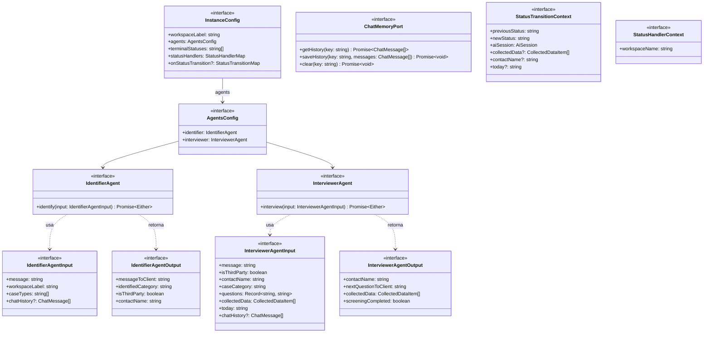
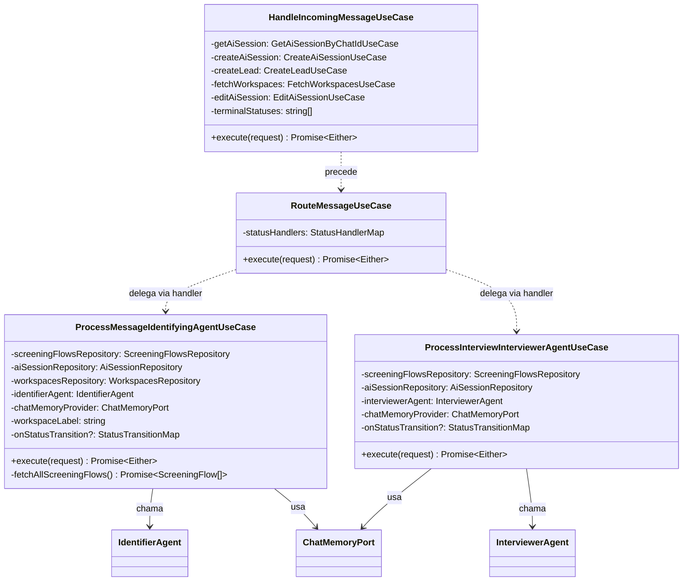
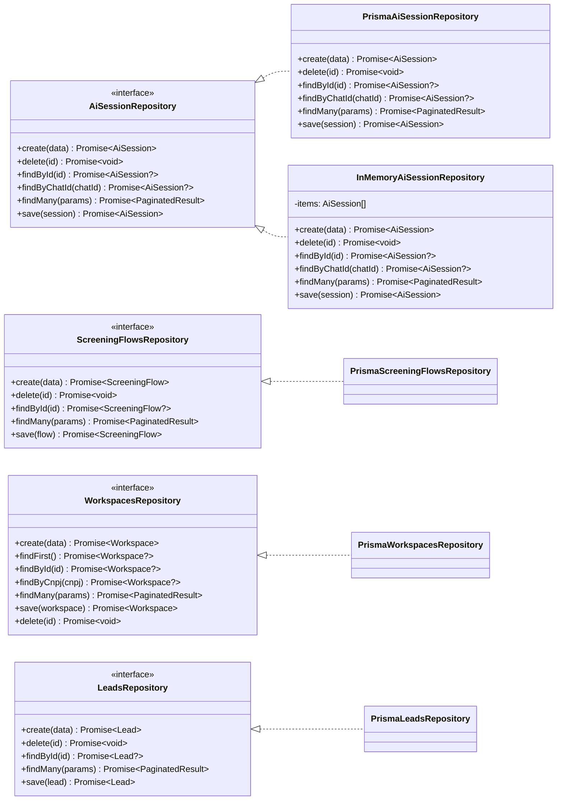

# Vero API — Documentação do Framework de Triagem Conversacional

> Este documento descreve exclusivamente o **framework** que sustenta o fluxo de atendimento conversacional via WhatsApp. Ele é independente do domínio de negócio (advocacia, clínica, construtora, etc.) e pode ser reutilizado por qualquer instância que implemente seus contratos.

---

## Índice

1. [Visão Geral](#1-visão-geral)
2. [Pontos Fixos do Framework](#2-pontos-fixos-do-framework)
3. [Pontos Variáveis do Framework](#3-pontos-variáveis-do-framework)
4. [Como os Pontos Variáveis são Implementados (lado do framework)](#4-como-os-pontos-variáveis-são-implementados-lado-do-framework)
5. [Diagrama de Classes da Arquitetura do Framework](#5-diagrama-de-classes-da-arquitetura-do-framework)

---

## 1. Visão Geral

O framework é um **motor de triagem conversacional** stateful. Ele recebe mensagens de um contato externo (ex: WhatsApp), mantém uma sessão de atendimento com estado persistido, e delega o processamento de cada mensagem para um **handler** determinado pelo **status atual** da sessão.

O framework **não conhece** nenhum domínio específico. Ele apenas:

1. Recebe uma mensagem.
2. Localiza (ou cria) a sessão do contato.
3. Roteia a mensagem para o handler do status atual.
4. Persiste a transição de estado.
5. Notifica a instância via hooks sobre as transições ocorridas.

A instância (o projeto concreto) é responsável por preencher todos os pontos variáveis: agentes de IA, handlers de status, hooks de transição e memória de chat.

---

## 2. Pontos Fixos do Framework

Pontos fixos são as abstrações e comportamentos que o framework define e controla. **A instância não pode alterá-los — apenas implementar seus contratos.**

### 2.1 `HandleIncomingMessageUseCase`

**Arquivo:** `src/core/use-cases/orchestrator/handle-incoming-message.ts`

Responsável por **gerenciar o ciclo de vida da sessão**. É fixo porque toda instância precisa dessa lógica:

- Se não há sessão ativa para o `chatId`, **cria uma nova** `AiSession` e um `Lead`.
- Se a sessão existe mas está em um **status terminal** (`terminalStatuses`), reinicia a sessão (cria nova).
- Se a sessão existe e está ativa, retorna ela para prosseguir.

Recebe `terminalStatuses` como parâmetro de construção (vindo da instância), mas a **lógica de decisão é invariável**.

### 2.2 `RouteMessageUseCase`

**Arquivo:** `src/core/use-cases/orchestrator/route-message-use-case.ts`

Responsável por **despachar a mensagem para o handler correto** com base no `status` da sessão. É fixo porque o mecanismo de roteamento é sempre o mesmo:

```
statusHandlers[aiSession.status](session, message, ctx)
```

Se nenhum handler for encontrado para o status, retorna `UnknownStatusError`. O core nunca toma uma decisão de domínio — apenas delega ao handler registrado.

### 2.3 `ProcessMessageIdentifyingAgentUseCase`

**Arquivo:** `src/core/use-cases/orchestrator/agents/process-message-identifying-agent.ts`

Define o **fluxo fixo da fase de identificação**:

1. Carrega todos os `ScreeningFlow` cadastrados no banco.
2. Recupera o histórico de chat da memória via `ChatMemoryPort`.
3. Chama o agente `IdentifierAgent.identify()` com os dados.
4. Salva o histórico atualizado na memória.
5. Se o lead foi identificado: atualiza o status da sessão para `"INTERVIEWING"`, persiste e dispara o hook `onStatusTransition["INTERVIEWING"]`.

O **algoritmo** é fixo. O **agente** (`IdentifierAgent`) e a **memória** (`ChatMemoryPort`) são injetados.

### 2.4 `ProcessInterviewInterviewerAgentUseCase`

**Arquivo:** `src/core/use-cases/orchestrator/agents/process-interview-interviewer-agent.ts`

Define o **fluxo fixo da fase de entrevista**:

1. Carrega o `ScreeningFlow` associado à sessão.
2. Lê os dados coletados do `chatState` da sessão.
3. Recupera o histórico de chat da memória.
4. Chama o agente `InterviewerAgent.interview()` com perguntas e dados coletados.
5. Salva histórico atualizado e dados coletados (`chatState`).
6. Se a triagem foi concluída: atualiza o status para `"FORWARDED"`, persiste e dispara `onStatusTransition["FORWARDED"]`.

### 2.5 Interfaces (Ports) dos Agentes

**Diretório:** `src/core/agents/ports/`

| Interface | Arquivo | Descrição |
|-----------|---------|-----------|
| `IdentifierAgent` | `identifier-agent.port.ts` | Contrato do agente de identificação de leads |
| `InterviewerAgent` | `interviewer-agent.port.ts` | Contrato do agente de entrevista de triagem |
| `ChatMemoryPort` | `chat-memory.port.ts` | Contrato do provedor de memória de chat |

Estas interfaces são **fixas**: o framework as define e as usa internamente. A instância deve fornecer implementações concretas.

### 2.6 `InstanceConfig` (Contrato de extensão)

**Arquivo:** `src/core/config/instance-config.port.ts`

É o **único ponto de extensão oficial** do framework. É fixo porque define o **contrato** que toda instância deve respeitar. O framework só aceita uma instância que satisfaça esta interface.

### 2.7 Tipos de Orquestração

**Arquivo:** `src/core/orchestrator/session-status-handler.ts`

Define os tipos fundamentais do sistema de roteamento:

| Tipo | Descrição |
|------|-----------|
| `StatusHandler` | Função `(session, message, ctx) => Promise<Either<Error, {reply}>>` |
| `StatusHandlerMap` | `Record<string, StatusHandler>` — mapa status → handler |
| `StatusTransitionContext` | Contexto fornecido aos hooks pós-transição |
| `StatusTransitionHandler` | Função `(ctx) => Promise<void>` executada após transição |
| `StatusTransitionMap` | `Record<string, StatusTransitionHandler>` — mapa status → hook |

### 2.8 Repositórios do Core

**Diretório:** `src/core/repositories/`

O framework define e usa diretamente as seguintes interfaces de repositório:

| Interface | Arquivo |
|-----------|---------|
| `AiSessionRepository` | `ai-session-repository.ts` |
| `ScreeningFlowsRepository` | `screening-flows-repository.ts` |
| `WorkspacesRepository` | `workspaces-repository.ts` |
| `LeadsRepository` | `leads-repository.ts` |

---

## 3. Pontos Variáveis do Framework

Pontos variáveis são aspectos que **cada instância define** ao implementar o contrato `InstanceConfig`. O framework os consome mas nunca os conhece em detalhes.

### 3.1 `workspaceLabel` — Rótulo do domínio

```typescript
workspaceLabel: string
// Exemplos: "escritório de advocacia" | "clínica médica" | "construtora"
```

Usado nos **prompts dos agentes** para contextualizar o tipo de negócio. O framework repassa o valor ao `ProcessMessageIdentifyingAgentUseCase`, que o injeta no agente identificador.

### 3.2 `agents` — Implementações dos Agentes de IA

```typescript
agents: {
  identifier: IdentifierAgent;
  interviewer: InterviewerAgent;
}
```

A instância fornece as implementações concretas dos dois agentes de IA. O framework as consome via as interfaces `IdentifierAgent` e `InterviewerAgent`. Pode ser qualquer LLM (Gemini, OpenAI, Anthropic, etc.) desde que respeite os contratos.

### 3.3 `terminalStatuses` — Status que encerram sessões

```typescript
terminalStatuses: string[]
// Exemplo: ["BOOKED"] | ["COMPLETED", "DISCHARGED"]
```

Lista de status que indicam que a sessão está encerrada. Quando o `HandleIncomingMessageUseCase` detecta que a sessão está em um desses status, reinicia a sessão (cria nova) para o próximo contato do mesmo número.

### 3.4 `statusHandlers` — Mapa de handlers de status

```typescript
statusHandlers: StatusHandlerMap
// StatusHandlerMap = Record<string, StatusHandler>
```

O núcleo do sistema de roteamento. A instância define **todos os status possíveis** e **como cada um responde** a uma mensagem recebida. O framework não conhece nenhum status específico — apenas busca o handler registrado para o status atual da sessão.

Cada handler tem a assinatura:
```typescript
(session: AiSession, message: string, ctx: StatusHandlerContext) => Promise<Either<Error, { reply: string }>>
```

### 3.5 `onStatusTransition` — Hooks pós-transição de status

```typescript
onStatusTransition?: StatusTransitionMap
// StatusTransitionMap = Record<string, StatusTransitionHandler>
```

Mapa opcional de hooks executados **imediatamente após** o framework persistir uma transição de status. Permite que a instância execute lógica de domínio em reação a eventos do fluxo sem modificar o core.

Cada hook recebe um `StatusTransitionContext` com:
- `previousStatus` e `newStatus`
- `aiSession` (já atualizada)
- `collectedData?` (disponível na transição para `FORWARDED`)
- `contactName?`
- `today?`

---

## 4. Como os Pontos Variáveis são Implementados (lado do framework)

Esta seção descreve **onde e como** o framework consome cada ponto variável — ou seja, os mecanismos internos de injeção e invocação.

### 4.1 Injeção via construtor (`HandleIncomingMessageUseCase`)

O `terminalStatuses` é injetado no construtor do `HandleIncomingMessageUseCase`:

```typescript
// src/core/use-cases/orchestrator/handle-incoming-message.ts
export class HandleIncomingMessageUseCase {
  constructor(
    private readonly getAiSession: GetAiSessionByChatIdUseCase,
    private readonly createAiSession: CreateAiSessionUseCase,
    private readonly createLead: CreateLeadUseCase,
    private readonly fetchWorkspaces: FetchWorkspacesUseCase,
    private readonly editAiSession: EditAiSessionUseCase,
    /** ← Vem do InstanceConfig.terminalStatuses */
    private readonly terminalStatuses: string[],
  ) {}

  async execute({ phoneNumber, contactName, chatId }) {
    const session = await this.getAiSession.execute({ chatId });

    const isTerminalSession =
      session.isRight() &&
      this.terminalStatuses.includes(session.value.aiSession.status);
      //                 ↑ Verificação usa o valor injetado

    if (session.isLeft() || isTerminalSession) {
      // cria nova sessão + lead...
    }
  }
}
```

### 4.2 Roteamento por mapa (`RouteMessageUseCase`)

O `statusHandlers` é injetado no construtor do `RouteMessageUseCase` e invocado dinamicamente:

```typescript
// src/core/use-cases/orchestrator/route-message-use-case.ts
export class RouteMessageUseCase {
  constructor(
    /** ← Vem do InstanceConfig.statusHandlers */
    private readonly statusHandlers: StatusHandlerMap,
  ) {}

  async execute({ aiSession, messageText }) {
    // Busca o handler para o status atual da sessão
    const handler = this.statusHandlers[aiSession.status];

    if (!handler) {
      return left(new UnknownStatusError()); // status desconhecido
    }

    // Delega ao handler da instância — o core nunca interpreta o resultado
    const result = await handler(aiSession, messageText, {
      workspaceName: aiSession.name,
    });

    if (result.isLeft()) return left(result.value);
    return right({ messageToClient: result.value?.reply ?? "" });
  }
}
```

### 4.3 Invocação dos agentes (`ProcessMessageIdentifyingAgentUseCase`)

Os agentes (`IdentifierAgent`, `InterviewerAgent`) e a memória (`ChatMemoryPort`) são injetados nos use cases do core e chamados via os contratos:

```typescript
// src/core/use-cases/orchestrator/agents/process-message-identifying-agent.ts
export class ProcessMessageIdentifyingAgentUseCase {
  constructor(
    private readonly screeningFlowsRepository: ScreeningFlowsRepository,
    private readonly aiSessionRepository: AiSessionRepository,
    private readonly workspacesRepository: WorkspacesRepository,
    /** ← Vem do InstanceConfig.agents.identifier */
    private readonly identifierAgent: IdentifierAgent,
    /** ← Vem do provedor de memória configurado na factory */
    private readonly chatMemoryProvider: ChatMemoryPort,
    /** ← Vem do InstanceConfig.workspaceLabel */
    private readonly workspaceLabel: string,
    /** ← Vem do InstanceConfig.onStatusTransition */
    private readonly onStatusTransition?: StatusTransitionMap,
  ) {}

  async execute({ aiSession, messageText }) {
    // Usa o workspaceLabel e os caseTypes nos inputs do agente
    const agentResult = await this.identifierAgent.identify({
      message: messageText,
      workspaceLabel: this.workspaceLabel,  // ← ponto variável
      caseTypes,
      chatHistory,
    });

    // Quando identificado, transita de status e dispara o hook
    aiSession.status = "INTERVIEWING";
    await this.aiSessionRepository.save(aiSession);

    // Hook pós-transição — invocado via optional chaining
    await this.onStatusTransition?.["INTERVIEWING"]?.({
      previousStatus,
      newStatus: "INTERVIEWING",
      aiSession,
      contactName: agentOutput.contactName,
    });
  }
}
```

### 4.4 Invocação de hooks pós-transição (`onStatusTransition`)

O framework dispara hooks **após** persistir cada transição de status. O padrão de invocação usa optional chaining para garantir que a ausência do mapa ou de um hook específico não cause erros:

```typescript
// Padrão de disparo nos use cases do core:
await this.onStatusTransition?.["NOME_DO_STATUS"]?.(contexto);
```

Isso significa que:
- Se a instância não define `onStatusTransition`, nada é executado.
- Se a instância define o mapa mas não registra um hook para aquele status, nada é executado.
- Se o hook existe, ele é `await`ado antes de retornar a resposta ao cliente.

O `StatusTransitionContext` fornecido ao hook contém o máximo de informações disponíveis no momento da transição:

| Campo | Disponível em |
|-------|---------------|
| `previousStatus` | Todas as transições |
| `newStatus` | Todas as transições |
| `aiSession` | Todas as transições |
| `contactName` | `INTERVIEWING`, `FORWARDED` |
| `collectedData` | `FORWARDED` |
| `today` | `FORWARDED` |

### 4.5 Fábricas e composição

As fábricas do core montam os use cases injetando todos os pontos variáveis a partir do `InstanceConfig`:

```typescript
// Exemplo simplificado de factory no core
export function makeProcessMessageIdentifyingAgentUseCase(
  config: InstanceConfig,  // ← toda a configuração variável
) {
  return new ProcessMessageIdentifyingAgentUseCase(
    new PrismaScreeningFlowsRepository(),
    new PrismaAiSessionRepository(),
    new PrismaWorkspacesRepository(),
    config.agents.identifier,        // ← ponto variável
    new RedisChatMemoryProvider(),   // ← provedor de memória
    config.workspaceLabel,           // ← ponto variável
    config.onStatusTransition,       // ← ponto variável
  );
}
```

---

## 5. Diagrama de Classes da Arquitetura do Framework

### 5.1 Contratos (Ports/Interfaces) do Framework



---

### 5.2 Use Cases do Core (Pontos Fixos)



---

### 5.3 Repositórios do Core



---

### 5.4 Visão Completa: Framework + Instância

```mermaid
classDiagram
    direction TB

    class HandleIncomingMessageUseCase {
        <<core fixo>>
        -terminalStatuses: string[]
        +execute(request) Promise~Either~
    }

    class RouteMessageUseCase {
        <<core fixo>>
        -statusHandlers: StatusHandlerMap
        +execute(request) Promise~Either~
    }

    class ProcessMessageIdentifyingAgentUseCase {
        <<core fixo>>
        -identifierAgent: IdentifierAgent
        -chatMemoryProvider: ChatMemoryPort
        -workspaceLabel: string
        -onStatusTransition?: StatusTransitionMap
        +execute(request) Promise~Either~
    }

    class ProcessInterviewInterviewerAgentUseCase {
        <<core fixo>>
        -interviewerAgent: InterviewerAgent
        -chatMemoryProvider: ChatMemoryPort
        -onStatusTransition?: StatusTransitionMap
        +execute(request) Promise~Either~
    }

    class InstanceConfig {
        <<interface - ponto variavel>>
        +workspaceLabel: string
        +agents: AgentsConfig
        +terminalStatuses: string[]
        +statusHandlers: StatusHandlerMap
        +onStatusTransition?: StatusTransitionMap
    }

    class IdentifierAgent {
        <<interface - ponto variavel>>
        +identify(input) Promise~Either~
    }

    class InterviewerAgent {
        <<interface - ponto variavel>>
        +interview(input) Promise~Either~
    }

    class ChatMemoryPort {
        <<interface - ponto variavel>>
        +getHistory(key) Promise~ChatMessage[]~
        +saveHistory(key, messages) Promise~void~
        +clear(key) Promise~void~
    }

    class LawFirmInstanceConfig {
        <<instancia concreta>>
        +workspaceLabel: "escritório de advocacia"
        +terminalStatuses: ["BOOKED"]
        +statusHandlers: StatusHandlerMap
        +onStatusTransition: StatusTransitionMap
    }

    class GeminiIdentifierAgent {
        <<instancia concreta>>
        -model: "gemini-3-flash-preview"
        +identify(input) Promise~Either~
    }

    class GeminiInterviewerAgent {
        <<instancia concreta>>
        -model: "gemini-3-flash-preview"
        +interview(input) Promise~Either~
    }

    class RedisChatMemoryProvider {
        <<infra concreta>>
        +getHistory(key) Promise~ChatMessage[]~
        +saveHistory(key, messages) Promise~void~
        +clear(key) Promise~void~
    }

    class InMemoryChatMemoryProvider {
        <<infra concreta - testes>>
        -store: Map
        +getHistory(key) Promise~ChatMessage[]~
        +saveHistory(key, messages) Promise~void~
        +clear(key) Promise~void~
    }

    InstanceConfig <|.. LawFirmInstanceConfig
    IdentifierAgent <|.. GeminiIdentifierAgent
    InterviewerAgent <|.. GeminiInterviewerAgent
    ChatMemoryPort <|.. RedisChatMemoryProvider
    ChatMemoryPort <|.. InMemoryChatMemoryProvider

    HandleIncomingMessageUseCase ..> InstanceConfig : consome terminalStatuses
    RouteMessageUseCase ..> InstanceConfig : consome statusHandlers
    ProcessMessageIdentifyingAgentUseCase --> IdentifierAgent : chama via interface
    ProcessMessageIdentifyingAgentUseCase --> ChatMemoryPort : usa via interface
    ProcessMessageIdentifyingAgentUseCase ..> InstanceConfig : consome workspaceLabel e onStatusTransition
    ProcessInterviewInterviewerAgentUseCase --> InterviewerAgent : chama via interface
    ProcessInterviewInterviewerAgentUseCase --> ChatMemoryPort : usa via interface
    ProcessInterviewInterviewerAgentUseCase ..> InstanceConfig : consome onStatusTransition
```



---

## Resumo: Pontos Fixos × Variáveis

| Aspecto | Tipo | Onde está | Quem define |
|---------|------|-----------|-------------|
| Ciclo de vida da sessão | **Fixo** | `HandleIncomingMessageUseCase` | Framework |
| Roteamento por status | **Fixo** | `RouteMessageUseCase` | Framework |
| Fluxo de identificação | **Fixo** | `ProcessMessageIdentifyingAgentUseCase` | Framework |
| Fluxo de entrevista | **Fixo** | `ProcessInterviewInterviewerAgentUseCase` | Framework |
| Interfaces dos agentes | **Fixo** | `core/agents/ports/` | Framework |
| Contrato de extensão | **Fixo** | `InstanceConfig` | Framework |
| Rótulo do domínio | **Variável** | `InstanceConfig.workspaceLabel` | Instância |
| Implementações dos agentes | **Variável** | `InstanceConfig.agents` | Instância |
| Status terminais | **Variável** | `InstanceConfig.terminalStatuses` | Instância |
| Handlers de status | **Variável** | `InstanceConfig.statusHandlers` | Instância |
| Hooks de transição | **Variável** | `InstanceConfig.onStatusTransition` | Instância |
| Provedor de memória | **Variável** | `ChatMemoryPort` (injetado) | Instância/Infra |
